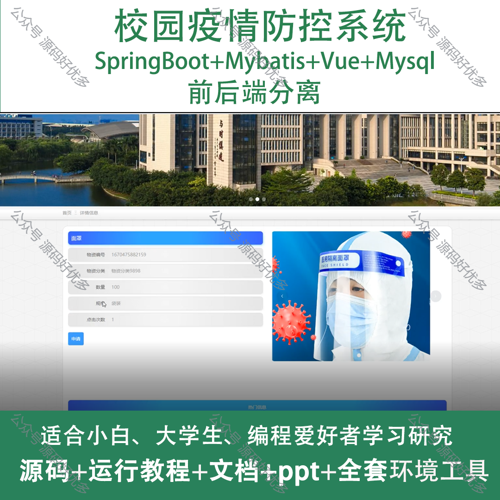
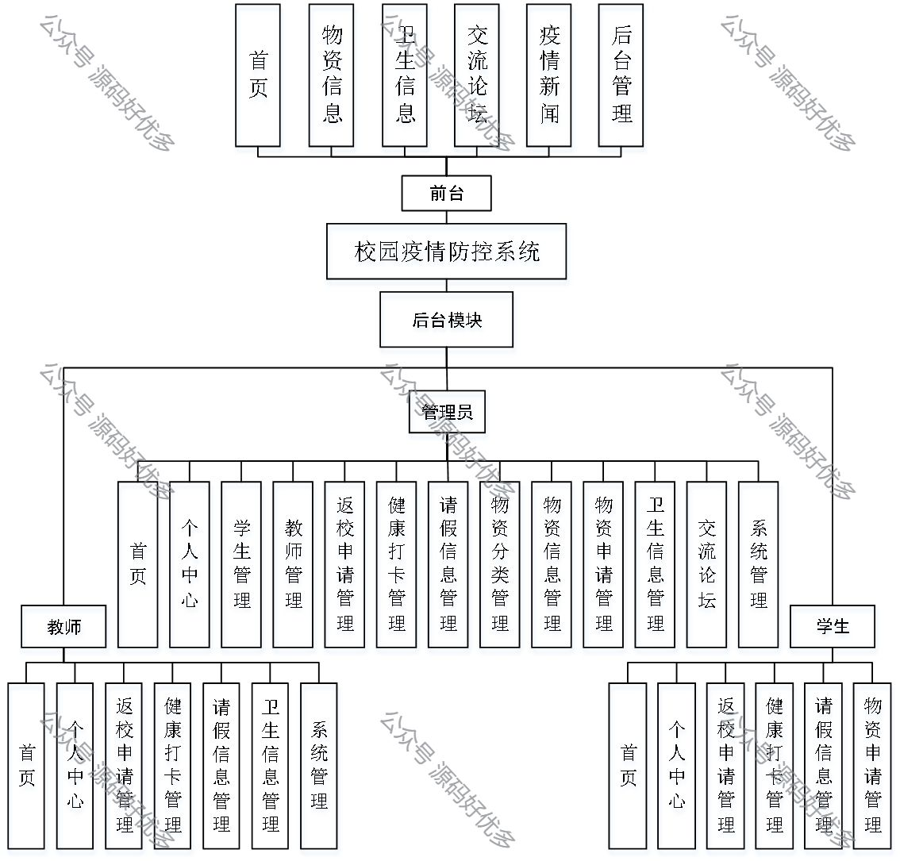
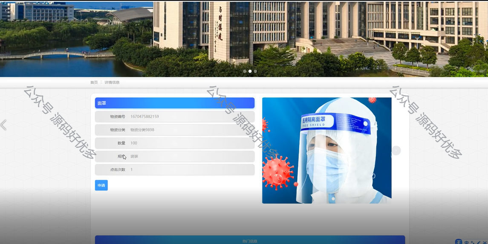
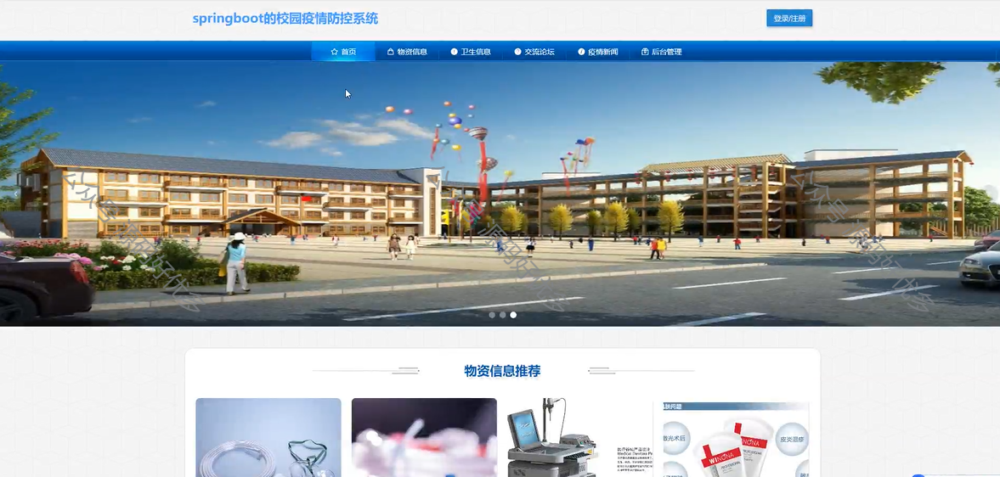
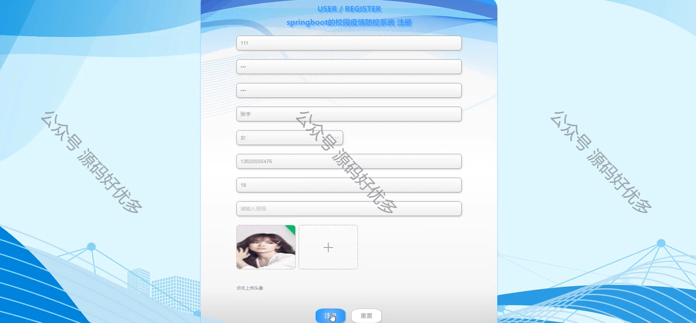
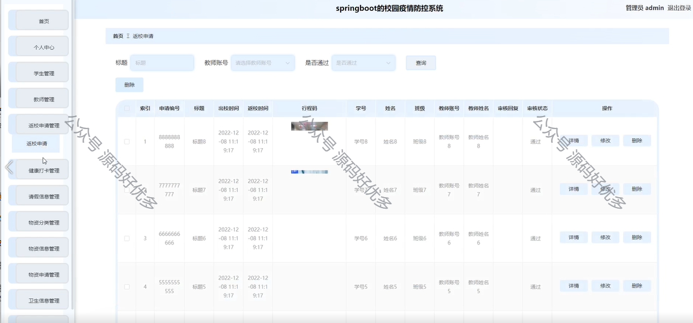
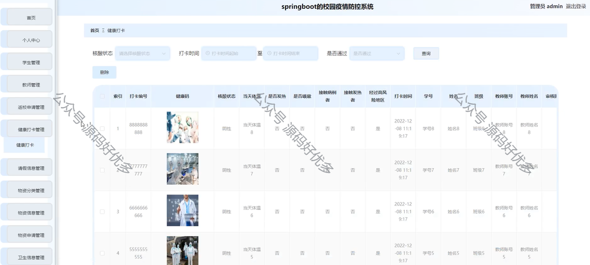
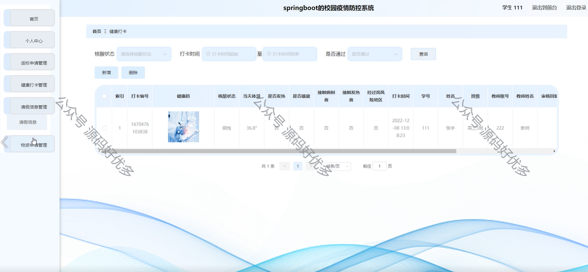
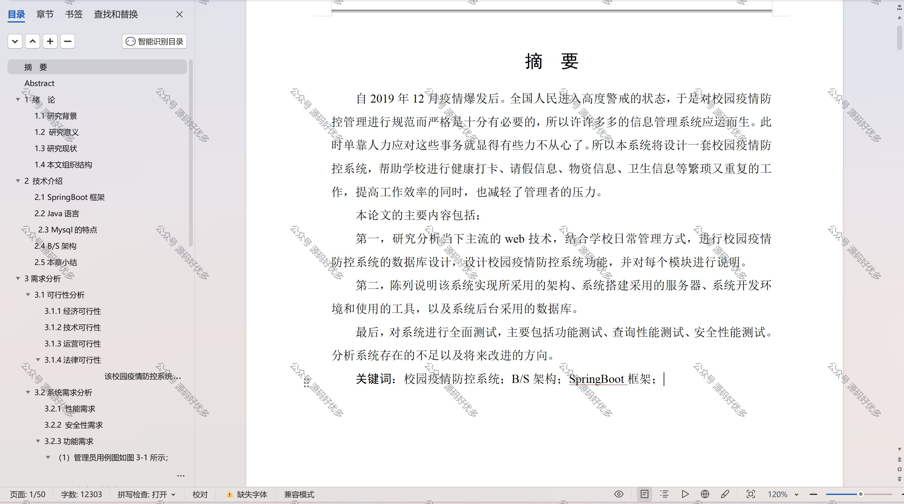

 
## 查看主页获取源码

> **作者介绍**： **✌**全网粉丝10W+本平台特邀作者、博客专家、CSDN新星计划导师、java领域优质创作者,博客之星、掘金/华为云/阿里云/InfoQ等平台优质作者、专注于项目实战 **✌**

  

### 一、作品包含

源码+数据库+设计文档万字+PPT+全套环境和工具资源+部署教程

### 二、项目技术

前端技术：Html、Css、Js、Vue、Element-ui

数据库：MySQL

后端技术：Java、Spring Boot、MyBatis

  

### 三、运行环境

开发工具：IDEA/eclipse

数据库：MySQL5.7

数据库管理工具：Navicat10以上版本

环境配置软件： JDK1.8+Maven3.6.3

前端Nodejs：14

### 四、项目介绍
项目编号：springbootA086

自2019年12月疫情爆发后。全国人民进入高度警戒的状态，于是对校园疫情防控管理进行规范而严格是十分有必要的，所以许许多多的信息管理系统应运而生。此时单靠人力应对这些事务就显得有些力不从心了。所以本系统将设计一套校园疫情防控系统，帮助学校进行健康打卡、请假信息、物资信息、卫生信息等繁琐又重复的工作，提高工作效率的同时，也减轻了管理者的压力。

### 五、运行截图

  
